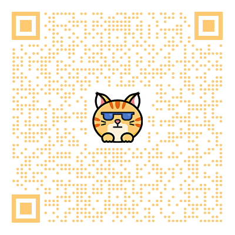
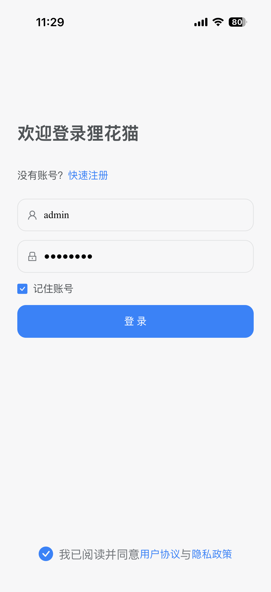
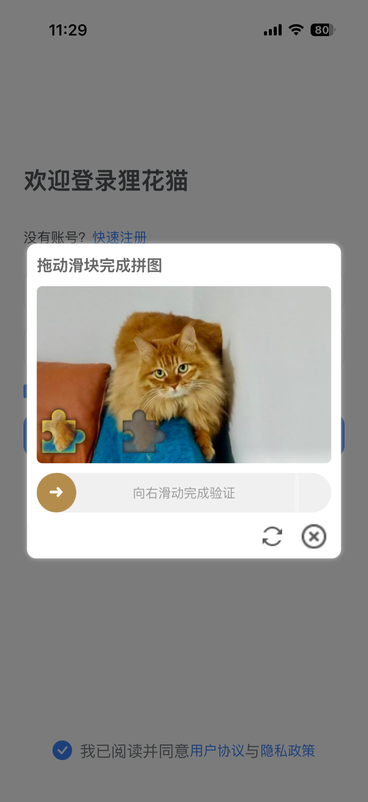
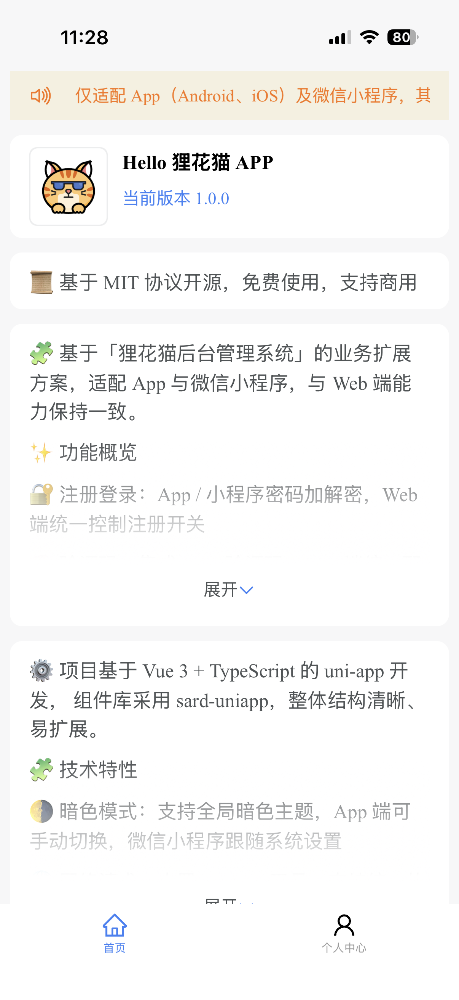
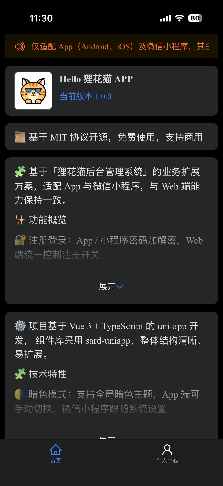

# Lihua App

基于「狸花猫后台管理系统」的业务扩展方案，uni-app 开发，适配 App 与微信小程序，与 Web 端能力保持一致。

## 功能特性

- 🔐 注册登录：App / 小程序密码加解密，Web 端统一控制注册开关
- 🧠 验证码：集成 tianai验证码，Web 端统一配置启用状态
- 👤 个人中心：头像、昵称等基础信息与后端保持一致
- 🛡️ 权限体系：支持角色、权限、部门标识，user store 可获取
- 🔔 通知公告：WebSocket 实时消息，App 原生通知提醒
- 🌗 暗色模式：支持全局暗色主题，App 端可手动切换，微信小程序跟随系统设置

## 技术特性

- 🔧 基础框架：Vue 3 + TypeScript，提供良好的类型约束与开发体验
- 🗂️ 状态管理：内置 Pinia 状态管理方案，统一管理全局状态，提升数据流可维护性
- 🌐 网络请求：内置 Request 工具，支持统一的请求 / 响应拦截处理
- 🧭 路由管理：基于 Router 实现路由跳转，支持前置拦截与权限校验
- 🧱 全局能力：集成 uni-ku/root，模拟 Web 端 Vue 根组件，便于集中处理全局逻辑

## 相关资源
- [开发文档](https://doc.lihua.xyz/)
- [介绍视频](https://www.bilibili.com/video/BV1RkqfBEEWx/?share_source=copy_web&vd_source=21488b91c9ae03cb3f590ee0d0bdb943)
- [后端仓库](https://gitee.com/yukino_git/lihua)
- 技术交流群：850464676

## 下载体验（apk）
- [狸花猫APP](https://gitee.com/yukino_git/lihua-app/releases/download/2.0.0/%E7%8B%B8%E8%8A%B1%E7%8C%ABAPP.apk)

<div style="display:flex; flex-wrap:wrap; gap:8px;">
	
</div>

## 组件库&关键依赖
- 项目组件库： [sard-uniapp](https://sard.wzt.zone/sard-uniapp-docs/)
- 虚拟根组件： [Uni Ku Root](https://uni-ku.js.org/projects/root/introduction)

## 项目截图
<div style="display:flex; flex-wrap:wrap; gap:8px;">
	
	
	
	
	
	
</div>

## 目录结构

```
├── .env.development                # 开发环境配置文件
├── .env.production                 # 生产环境配置文件
├── .gitignore                      # Git 忽略文件配置
├── LICENSE                         # 项目许可证
├── index.html                      # 入口 HTML 文件
├── package.json                    # 项目依赖和脚本配置
├── plugins/buildIcons.ts           # 图标构建脚本
├── shims-uni.d.ts                  # Uni-app 类型声明文件
├── src/                            # 源代码目录
│   ├── App.vue                     # 根 Vue 组件
│   ├── AppRoot.vue                 # 应用根组件
│   ├── api/                        # API 接口定义
│   ├── components/                 # 公共组件
│   ├── env.d.ts                    # 环境变量类型定义
│   ├── main.ts                     # 应用入口文件
│   ├── manifest.json               # 应用清单文件
│   ├── pages.json                  # 页面配置文件
│   ├── pages/                      # 页面组件
│   ├── router/                     # 路由配置
│   ├── shime-uni.d.ts              # Uni-app 类型声明文件
│   ├── static/                     # 静态资源
│   ├── stores/                     # 状态管理
│   ├── subpackages/                # 子包模块
│   ├── theme.json                  # 主题配置文件
│   ├── uni.scss                    # 全局样式文件
│   ├── utils/                      # 工具函数
│   └── vite.config.ts              # Vite 配置文件
```

## 许可证

本项目采用 MIT 许可证。详情请查看 LICENSE 文件。

